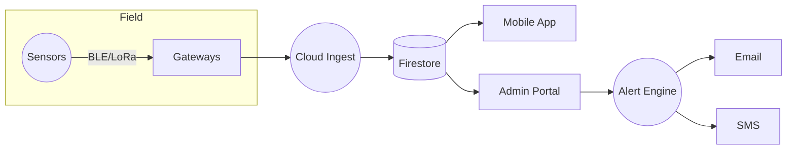

## Vision
Narrowboat Watch provides hierarchical monitoring of boats and sensors across marinas, basins, and jetties, with role-based access and remote alerts.

## High-level Architecture

```mermaid
flowchart LR
  subgraph Field
    Sensor1((Sensors)) -->|BLE/LoRa| Gateways
  end
  Gateways --> Ingest((Cloud Ingest))
  Ingest --> Firestore[(Firestore)]
  Firestore --> MobileApp[Mobile App]
  Firestore --> AdminPortal[Admin Portal]
  AdminPortal --> Alerting((Alert Engine))
  Alerting --> Email
  Alerting --> SMS
```
